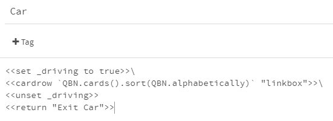

Getting Started with TinyQBN
============================

Start by opening Twine, creating a new story and setting its Story
Format to Sugarcube. Then we need to add the TinyQBN code.  Go to
the [TinyQBN GitHub
repository](https://github.com/JoshuaGrams/tiny-qbn#adding-tinyqbn-to-your-story).
Click on the link for the minified javascript, select "Raw", then
select all and copy it.  Go back to Twine, open the Story
Javascript from the menu in the bottom left, and paste it in.
Then go back to GitHub, select and copy the stylesheet and paste
it in to Twine's Story Stylesheet.

Finally, go to GitHub again and select and copy the widgets. These
are Sugarcube code, so make a new passage in your Twine story and
paste it in. Add a "widget" tag to the passage so Sugarcube knows
that it's code which needs to be loaded immediately. Give the
passage a name if you like (I usually call it "TinyQBN Widgets").

Now we're ready to start building the basic demo: a little setting
where you can drive around and see what local seasonal food is
available. We'll start with some locations that you can drive
between. The starting passage will be your home.

To make it a "card" that the QBN engine can find, you tag it with
"card" or "sticky-card". "card" is for single-use passages which
will be discarded after they are visited. But this is a physical
location.  We want to be able to visit it many times, so make it a
"sticky-card".

Right now this card has no requirements, no restrictions on when
it is available. So it will show up *every* time we select cards
and there will be no way to exclude it. So let's add some
requirements about when we can draw this card. Requirements are
tags starting with `req-`. Add a tag `req-driving` to say that you
can only get here if you're driving.

This requirement will be satisfied if there is a non-empty story
variable `$driving` *or* a temporary variable `_driving` *or* we
pass a `driving` value when selecting cards. It doesn't
differentiate, mostly because tags can't contain dollar signs (or
spaces or any punctuation other than hyphens and underscores).

Also we need a way to drive somewhere else, so let's add a link
`[[Drive->Car]]`.

In the car, we're going to show you all the places you can drive
to. So we're going to say

	<<cardrow `QBN.passages({driving: true})` "linkedcard">>

`QBN.passages` will select all of the cards whose requirements are
satisfied by the current story state and the `driving` value that
we passed. The second argument is the name of a widget that will
be used to wrap each card. If you leave out `"linkedcard"` then it
will use "card", which shows the *contents* of the cards.

If we play the game and get in the car, we should see that we can
drive back home (even though we're already there, but we'll fix
that later). Let's add some other locations.  Some small farmers
like to give their farms cutesy names, so how about Fairweather
Farm? Give it a header and link to the car. Name the passage and
add the tags: `sticky-card` and `req-driving`. This is probably a
farm that sells organic vegetables and eggs from happy hens.

Then another farm, maybe with the surname of the owners? Anderson
Farm. Let's say that this is a more conventional third-generation
animal farm that produces beef and pork and some dairy products.
Set up the card just like the other two.

And...maybe this town is on the ocean, so you can drive to the
docks early in the morning and buy fresh fish from the boats which
are coming in. Set up another card for the Docks.

Now if you run the game you should be able to drive between all
the locations. Notice that they're listed in alphabetical order
instead of the order they were created or whatever. I haven't
decided whether or how to offer other sorting options.

It's a little silly to drive to the place where you already are,
so let's rule out driving to your current location. We'll start
with Home. Open the passage and add another tag:
`req-location-ne-home`. This will compare `$location` (or
`_location`) against the string `"home"`. Then go in to the
passage body and `<<set $location to "home">>\`. The backslash at
the end will prevent it from sticking an extra blank line into
your passage.

Do the same to the other locations. Since we can't put spaces in
tags, we'll shorten some of the names: "fairweather" and
"anderson".

We'll also add a link to the car so you can get out without
driving anywhere:

	<<return "Exit Car">>

Now if you play it, you should be able to exit the car and return
to your previous location, or drive to any of the other locations.

That's the end of this section: we'll continue in [part
2](tutorial-2.md).

[The sample so far](https://joshuagrams.github.io/tiny-qbn/doc/tutorial-1.html).
