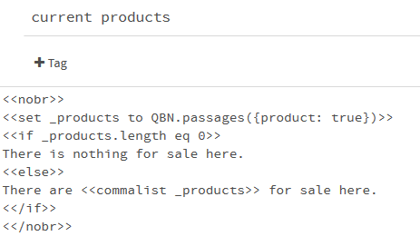
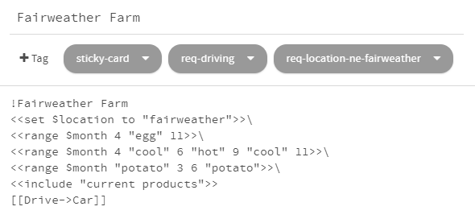
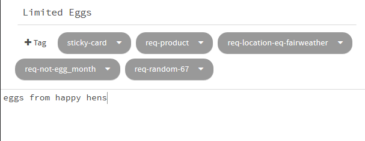

Adding Products and a Seasonal Cycle
====================================

We'll pick up where we left off [last time](tutorial-1.md). We're
going to add some products and make them available only in certain
seasons.

We'll re-use the product listing code for all the locations, so
let's put it in a passage that we can include. Create a passage
and name it "current products". This is going to be mostly code,
and the output doesn't need line breaks, so wrap the whole thing
in `<<nobr>>` tags to avoid accidentally displaying a bunch of
blank lines.

I want to display different text if there is nothing for sale, so
let's save the selected passages to a temporary variable.

	<<set _product to true>>
	<<set _products to QBN.cards()>>
	<<unset _product>>

Then we can check the length of the product list and respond
accordingly.

	<<if _products.length eq 0>>
	There is nothing for sale here.
	<<else>>
	There are <<cardlist _products>> here.
	<</if>>

`<<cardlist>>` is another one of my TinyQBN widgets. It creates a
comma-separated list of cards.

Now `<<include "current products">>` in each of the business
passages.

Now we can start adding products. Let's say that Fairweather farm
sells strawberries. So create a new passage named "Strawberries"
(though we're not going to use the title), and set its contents to
"ripe red strawberries". Tag it `sticky-card`, `req-product`, and
`req-location-eq-fairweather`.

Play the game, drive to Fairweather and check that they show up
there. You should also drive to one of the other locations to
check that they *don't* show up where they aren't supposed to be.

Now let's add a story variable to keep track of time. Create a
passage named StoryInit. This is a special passage that SugarCube
will run once when your story is first loaded. We'll create a
`$month` variable to track the current month, and an array to look
up the name of the current month. Since the month names will never
change, we'll store them as a property on the `setup` object that
SugarCube creates for us. That way SugarCube won't have to copy
them into its history every turn.

	<<set $month to 1>>
	<<set setup.monthnames to [""
		"January", "February", "March", "April",
		"May", "June", "July", "August",
		"September", "October", "November", "December"]>>

Test that to make sure there are no syntax errors.

To advance time, we'll make a widget. That way, if we accidentally
end up in month 13 or something, there's only one piece of code
that could be causing the problem. Create a new passage, name it
"nextmonth" (or whatever), tag it `widget`, and write:

	<<widget "nextmonth">>
	<<if $month is 12>>
		<<set $month to 1>>
	<<else>>
		<<set $month to $month + 1>>
	<</if>>
	<</widget>>

Open up Home and have it report the current month. Let's put this
in the headline. Change `!Home` to:

	!Home (<<print setup.monthnames[$month]>>)

Also add a link to advance the month:

	<<link "Next Month" "Home">><<nextmonth>><</link>>

Now we'll say that Fairweather grows day-neutral strawberry
varieties that keep producing from May through September. Open up
the passage, tag it `req-month-ge-5` and `req-month-le-9`. Test
that to make sure strawberries only show up in the appropriate
months.

Let's also add eggs. But let's make them available all the time in
the summer, and only maybe two-thirds of the time in the winter.
In the Fairweather Farm passage, we'll use `<<range>>` to define a
temporary `_egg_month` variable.

	<<range $month 4 "egg" 11>>\

The range macro will divide a variable's range up into parts and
define a variable if it's in a named range. This will set
`_egg_month` if `$month` is 4 through 10, because the next range
starts at exactly 11.

Now we'll create two passages. Name the first "Plentiful Eggs", set
its contents to "eggs from happy hens", and tag it `sticky-card`,
`req-product`, `req-location-eq-fairweather` and `req-egg_month`
(note the underscore in that last one). 

The other one will be "Limited Eggs", and will be exactly the same
except it will have `req-not-egg_month` and `req-random-67` (which
is a requirement that will be randomly satisfied 67% of the time).
So in the off season we'll still have eggs about two-thirds of the
time. Play the story and make sure that works.

Note that `not-egg_month` is two separate ranges: January through
March and November through December. We could not have done this
with the numeric comparison tags. This demonstrates a major
limitation of this system: you have to match *all* the tags.
There's no way to say, "match this requirement **or** that
requirement". So you either have to do the computation externally,
as we did here, or duplicate the card and have one for each range.

OK, that's the end of this section. I'll add some more products
and then in [part 3](tutorial-3.md) we'll tell some stories about
other customers reacting to what's available.

[The sample so far](https://joshuagrams.github.io/tiny-qbn/doc/tutorial-2.html).
